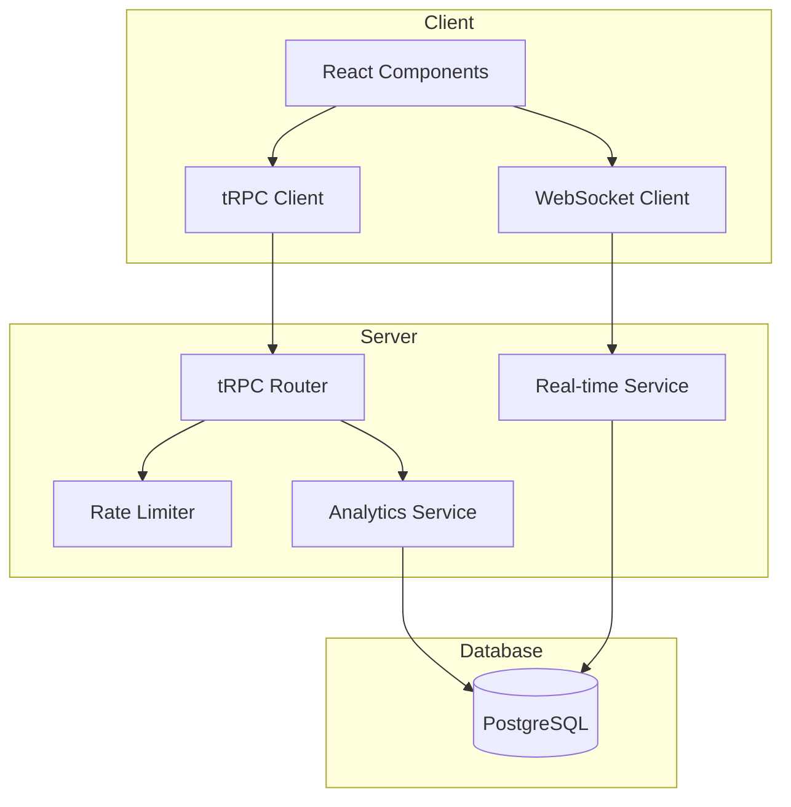

# Design Document: Social Engagement Features

## Overview

This design document outlines the implementation of comprehensive social media-style engagement features and real-time activity tracking for the music hosting platform. The system will add voting, analytics tracking, trending content algorithms, and a live activity dashboard to make the platform feel alive and engaging.

## Architecture

The social engagement system follows a layered architecture:



### Key Design Decisions

1. **Server-Sent Events (SSE) over WebSocket**: SSE is simpler to implement, works through HTTP, and is sufficient for one-way real-time updates (server to client). WebSocket would be overkill for this use case.

2. **IP Hashing for Privacy**: Store SHA-256 hashed IP addresses to prevent duplicate voting while protecting user privacy.

3. **Denormalized Counters**: Store aggregate counts (playCount, downloadCount, viewCount, upvotes, downvotes) directly on the mediaFiles table for fast reads, with detailed logs in separate tables for analytics.

4. **Time-bucketed Hotness Calculation**: Pre-calculate hotness scores periodically rather than on every request to reduce database load.

## Components and Interfaces

### Database Schema Extensions

```typescript
// New tables to add to drizzle/schema.ts

// Vote type enum
export const voteTypeEnum = pgEnum("vote_type", ["up", "down"]);

// Activity type enum  
export const activityTypeEnum = pgEnum("activity_type", [
  "play", "download", "view", "upload", "comment", "vote"
]);

// Votes table - tracks thumbs up/down per media file
export const votes = pgTable("votes", {
  id: serial("id").primaryKey(),
  mediaFileId: integer("media_file_id").notNull(),
  ipHash: varchar("ip_hash", { length: 64 }).notNull(),
  sessionId: varchar("session_id", { length: 64 }),
  voteType: voteTypeEnum("vote_type").notNull(),
  createdAt: timestamp("createdAt").defaultNow().notNull(),
  updatedAt: timestamp("updatedAt").defaultNow().notNull(),
}, (table) => ({
  mediaFileIdIdx: index("votes_media_file_id_idx").on(table.mediaFileId),
  ipHashIdx: index("votes_ip_hash_idx").on(table.ipHash),
  uniqueVote: uniqueIndex("votes_unique_vote").on(table.mediaFileId, table.ipHash),
}));

// Play logs - detailed play event tracking
export const playLogs = pgTable("play_logs", {
  id: serial("id").primaryKey(),
  mediaFileId: integer("media_file_id").notNull(),
  ipHash: varchar("ip_hash", { length: 64 }).notNull(),
  sessionId: varchar("session_id", { length: 64 }),
  playDuration: integer("play_duration"), // seconds played
  completedAt: timestamp("completedAt").defaultNow().notNull(),
}, (table) => ({
  mediaFileIdIdx: index("play_logs_media_file_id_idx").on(table.mediaFileId),
  completedAtIdx: index("play_logs_completed_at_idx").on(table.completedAt),
}));

// Download logs
export const downloadLogs = pgTable("download_logs", {
  id: serial("id").primaryKey(),
  mediaFileId: integer("media_file_id").notNull(),
  ipHash: varchar("ip_hash", { length: 64 }).notNull(),
  downloadedAt: timestamp("downloadedAt").defaultNow().notNull(),
}, (table) => ({
  mediaFileIdIdx: index("download_logs_media_file_id_idx").on(table.mediaFileId),
  downloadedAtIdx: index("download_logs_downloaded_at_idx").on(table.downloadedAt),
}));

// View logs
export const viewLogs = pgTable("view_logs", {
  id: serial("id").primaryKey(),
  mediaFileId: integer("media_file_id").notNull(),
  ipHash: varchar("ip_hash", { length: 64 }).notNull(),
  viewedAt: timestamp("viewedAt").defaultNow().notNull(),
}, (table) => ({
  mediaFileIdIdx: index("view_logs_media_file_id_idx").on(table.mediaFileId),
  viewedAtIdx: index("view_logs_viewed_at_idx").on(table.viewedAt),
}));

// Activity feed - stores recent platform activity
export const activityFeed = pgTable("activity_feed", {
  id: serial("id").primaryKey(),
  activityType: activityTypeEnum("activity_type").notNull(),
  mediaFileId: integer("media_file_id"),
  mediaTitle: varchar("media_title", { length: 255 }),
  ipHash: varchar("ip_hash", { length: 64 }),
  location: varchar("location", { length: 100 }), // City/Country from IP
  metadata: text("metadata"), // JSON for additional data
  createdAt: timestamp("createdAt").defaultNow().notNull(),
}, (table) => ({
  createdAtIdx: index("activity_feed_created_at_idx").on(table.createdAt),
  activityTypeIdx: index("activity_feed_activity_type_idx").on(table.activityType),
}));

// Add engagement columns to mediaFiles table
// playCount: integer("play_count").default(0).notNull(),
// downloadCount: integer("download_count").default(0).notNull(),
// viewCount: integer("view_count").default(0).notNull(),
// upvotes: integer("upvotes").default(0).notNull(),
// downvotes: integer("downvotes").default(0).notNull(),
// hotnessScore: integer("hotness_score").default(0).notNull(),
// lastHotnessUpdate: timestamp("last_hotness_update"),
```

### tRPC Router Extensions

```typescript
// New engagement router in server/routers.ts

engagement: router({
  // Voting
  vote: publicProcedure
    .input(z.object({
      mediaFileId: z.number(),
      voteType: z.enum(["up", "down"]),
    }))
    .mutation(async ({ input, ctx }) => {
      // Get IP hash from request
      // Check rate limit
      // Upsert vote (change or create)
      // Update denormalized counts on mediaFiles
      // Broadcast to activity feed
    }),

  removeVote: publicProcedure
    .input(z.object({ mediaFileId: z.number() }))
    .mutation(async ({ input, ctx }) => {
      // Remove vote and update counts
    }),

  getVoteStatus: publicProcedure
    .input(z.object({ mediaFileId: z.number() }))
    .query(async ({ input, ctx }) => {
      // Return current user's vote status (up/down/none)
    }),

  // Analytics tracking
  recordPlay: publicProcedure
    .input(z.object({
      mediaFileId: z.number(),
      playDuration: z.number().optional(),
    }))
    .mutation(async ({ input, ctx }) => {
      // Record play event
      // Increment play count
      // Add to activity feed
    }),

  recordDownload: publicProcedure
    .input(z.object({ mediaFileId: z.number() }))
    .mutation(async ({ input, ctx }) => {
      // Record download event
      // Increment download count
      // Add to activity feed
    }),

  recordView: publicProcedure
    .input(z.object({ mediaFileId: z.number() }))
    .mutation(async ({ input, ctx }) => {
      // Record view event
      // Increment view count
    }),

  // Trending and popular content
  getTrending: publicProcedure
    .input(z.object({
      limit: z.number().min(1).max(50).default(10),
    }))
    .query(async ({ input }) => {
      // Return files with highest engagement velocity (last 24h)
    }),

  getPopular: publicProcedure
    .input(z.object({
      period: z.enum(["24h", "7d", "30d", "all"]),
      limit: z.number().min(1).max(50).default(10),
    }))
    .query(async ({ input }) => {
      // Return files ranked by play count for period
    }),

  getHot: publicProcedure
    .input(z.object({
      limit: z.number().min(1).max(50).default(10),
    }))
    .query(async ({ input }) => {
      // Return files with highest hotness score
    }),

  // Activity feed
  getRecentActivity: publicProcedure
    .input(z.object({
      limit: z.number().min(1).max(50).default(20),
    }))
    .query(async ({ input }) => {
      // Return recent activity feed items
    }),

  // Engagement stats for a media file
  getStats: publicProcedure
    .input(z.object({ mediaFileId: z.number() }))
    .query(async ({ input }) => {
      // Return all engagement stats for a file
    }),
}),
```

### React Components

#### VoteButtons Component
```typescript
interface VoteButtonsProps {
  mediaFileId: number;
  upvotes: number;
  downvotes: number;
  currentVote: "up" | "down" | null;
  onVote: (type: "up" | "down") => void;
  onRemoveVote: () => void;
  disabled?: boolean;
  size?: "sm" | "md" | "lg";
}
```

#### ActivityFeed Component
```typescript
interface ActivityFeedProps {
  maxItems?: number;
  autoRefresh?: boolean;
  refreshInterval?: number;
  collapsible?: boolean;
  defaultCollapsed?: boolean;
}

interface ActivityItem {
  id: number;
  type: "play" | "download" | "view" | "upload" | "comment" | "vote";
  mediaTitle: string;
  mediaFileId: number;
  location?: string;
  timestamp: Date;
}
```

#### PopularityMetrics Component
```typescript
interface PopularityMetricsProps {
  playCount: number;
  downloadCount: number;
  viewCount: number;
  upvotes: number;
  downvotes: number;
  compact?: boolean;
}
```

#### TrendingList Component
```typescript
interface TrendingListProps {
  period: "24h" | "7d" | "30d" | "all";
  limit?: number;
  showRank?: boolean;
}
```

### Server-Sent Events for Real-time Updates

```typescript
// server/sse.ts - Server-Sent Events handler

interface SSEClient {
  id: string;
  response: Response;
}

class ActivityBroadcaster {
  private clients: Map<string, SSEClient> = new Map();

  addClient(id: string, res: Response): void;
  removeClient(id: string): void;
  broadcast(event: ActivityEvent): void;
}

// Activity event types
type ActivityEvent = {
  type: "play" | "download" | "upload" | "comment" | "vote";
  data: {
    mediaFileId: number;
    mediaTitle: string;
    location?: string;
    timestamp: string;
  };
};
```

## Data Models

### Vote Model
```typescript
interface Vote {
  id: number;
  mediaFileId: number;
  ipHash: string;
  sessionId?: string;
  voteType: "up" | "down";
  createdAt: Date;
  updatedAt: Date;
}
```

### PlayLog Model
```typescript
interface PlayLog {
  id: number;
  mediaFileId: number;
  ipHash: string;
  sessionId?: string;
  playDuration?: number;
  completedAt: Date;
}
```

### ActivityFeedItem Model
```typescript
interface ActivityFeedItem {
  id: number;
  activityType: "play" | "download" | "view" | "upload" | "comment" | "vote";
  mediaFileId?: number;
  mediaTitle?: string;
  ipHash?: string;
  location?: string;
  metadata?: Record<string, unknown>;
  createdAt: Date;
}
```

### MediaFile Engagement Extension
```typescript
// Additional fields on MediaFile
interface MediaFileEngagement {
  playCount: number;
  downloadCount: number;
  viewCount: number;
  upvotes: number;
  downvotes: number;
  hotnessScore: number;
  lastHotnessUpdate?: Date;
}
```

### Hotness Score Algorithm
```typescript
function calculateHotnessScore(
  recentPlays: number,      // plays in last 24h
  recentVotes: number,      // net votes in last 24h
  recentComments: number,   // comments in last 24h
  recentDownloads: number,  // downloads in last 24h
  ageHours: number          // hours since upload
): number {
  // Weighted sum with time decay
  const playWeight = 1.0;
  const voteWeight = 2.0;
  const commentWeight = 3.0;
  const downloadWeight = 1.5;
  
  const rawScore = 
    (recentPlays * playWeight) +
    (recentVotes * voteWeight) +
    (recentComments * commentWeight) +
    (recentDownloads * downloadWeight);
  
  // Apply time decay (half-life of 24 hours)
  const decayFactor = Math.pow(0.5, ageHours / 24);
  
  return Math.round(rawScore * decayFactor * 100);
}
```


## Correctness Properties

*A property is a characteristic or behavior that should hold true across all valid executions of a system—essentially, a formal statement about what the system should do. Properties serve as the bridge between human-readable specifications and machine-verifiable correctness guarantees.*

### Property 1: Vote Recording and Count Update

*For any* media file and any vote action (up or down), recording the vote SHALL result in the corresponding vote count (upvotes or downvotes) increasing by exactly 1, and a vote record being persisted with the correct vote type.

**Validates: Requirements 1.1, 1.2, 1.5, 1.6**

### Property 2: Vote Uniqueness Per IP/Media File

*For any* IP hash and media file combination, there SHALL be at most one vote record. Attempting to create a duplicate vote from the same IP hash for the same media file SHALL update the existing vote rather than create a new one.

**Validates: Requirements 1.4**

### Property 3: Vote Modification Round-Trip

*For any* existing vote, changing the vote type (up to down, or down to up) SHALL update the vote record and adjust both vote counts accordingly (decrement old type, increment new type). Removing a vote SHALL delete the record and decrement the appropriate count.

**Validates: Requirements 1.3**

### Property 4: Event Log Data Completeness

*For any* engagement event (play, download, or view), the created log record SHALL contain: mediaFileId, ipHash, and timestamp. Play logs SHALL additionally contain playDuration when provided.

**Validates: Requirements 2.2, 3.2, 4.2**

### Property 5: Engagement Metrics in Media File Response

*For any* media file query response, the returned data SHALL include all engagement metrics: playCount, downloadCount, viewCount, upvotes, and downvotes as numeric values.

**Validates: Requirements 2.3, 3.3, 4.3**

### Property 6: Play Count Time-Period Filtering

*For any* time period (24h, 7d, 30d, all-time) and media file, querying play counts SHALL return only plays that occurred within that time window. The count for a shorter period SHALL be less than or equal to the count for a longer period.

**Validates: Requirements 2.4**

### Property 7: Hotness Score Calculation Consistency

*For any* set of engagement metrics (recentPlays, recentVotes, recentComments, recentDownloads, ageHours), the calculated hotness score SHALL follow the defined formula: weighted sum with time decay. Files with higher recent engagement SHALL have higher hotness scores than files with lower engagement (all else being equal).

**Validates: Requirements 5.1**

### Property 8: Trending List Ordering

*For any* trending list query, the returned files SHALL be ordered by engagement velocity (descending). For any two adjacent files in the list, the first file's engagement velocity SHALL be greater than or equal to the second file's.

**Validates: Requirements 5.2**

### Property 9: Popular List Ordering by Play Count

*For any* popular list query with a specified time period, the returned files SHALL be ordered by play count within that period (descending). For any two adjacent files, the first file's play count SHALL be greater than or equal to the second file's.

**Validates: Requirements 5.3**

### Property 10: Activity Feed Item Creation

*For any* engagement action (play, download, upload, comment, vote), an activity feed item SHALL be created with: activityType matching the action, mediaFileId, mediaTitle, and createdAt timestamp.

**Validates: Requirements 6.1, 6.2, 6.3, 6.4**

### Property 11: Activity Feed Recency and Limit

*For any* activity feed query with a limit N, the returned items SHALL be the N most recent activities, ordered by createdAt descending. The number of returned items SHALL be at most N.

**Validates: Requirements 6.5**

### Property 12: Rate Limiting Enforcement

*For any* IP hash, if the number of actions of a given type exceeds the configured limit within the time window, subsequent actions SHALL be rejected with a rate limit error. Actions below the limit SHALL succeed.

**Validates: Requirements 8.1, 8.2**

### Property 13: IP Hashing for Privacy

*For any* stored vote, play log, download log, view log, or activity feed item, the ipHash field SHALL be a SHA-256 hash of the original IP address, not the plain IP address. The hash SHALL be deterministic (same IP always produces same hash).

**Validates: Requirements 8.3**

### Property 14: API Error Message Descriptiveness

*For any* failed API request, the error response SHALL include a descriptive message indicating the nature of the failure (e.g., "Rate limit exceeded", "Media file not found", "Invalid vote type").

**Validates: Requirements 9.5**

## Error Handling

### Rate Limit Errors
- Return HTTP 429 with message "Rate limit exceeded. Please try again in X seconds."
- Include `Retry-After` header with seconds until limit resets

### Not Found Errors
- Return HTTP 404 with message "Media file not found" when mediaFileId doesn't exist

### Validation Errors
- Return HTTP 400 with specific field validation messages

### Database Errors
- Log error details server-side
- Return HTTP 500 with generic "Internal server error" message to client

### SSE Connection Errors
- Implement automatic reconnection with exponential backoff
- Show "Reconnecting..." status in UI

## Testing Strategy

### Unit Tests
Unit tests will verify specific examples and edge cases:

1. **Vote edge cases**: Voting on non-existent media file, removing non-existent vote
2. **Rate limit boundaries**: Exactly at limit, one over limit
3. **Time period boundaries**: Events exactly at period boundary
4. **IP hashing**: Verify hash format and determinism
5. **Hotness score edge cases**: Zero engagement, very old content

### Property-Based Tests
Property-based tests will use **fast-check** library for TypeScript to verify universal properties:

1. **Vote invariants**: Count consistency after any sequence of vote operations
2. **Log completeness**: All required fields present for any generated event
3. **Ordering properties**: Lists always sorted correctly
4. **Rate limiting**: Correct enforcement for any action sequence
5. **Hotness calculation**: Formula correctness for any input values

### Test Configuration
- Minimum 100 iterations per property test
- Use fast-check for property-based testing
- Tag format: **Feature: social-engagement, Property {number}: {property_text}**

### Integration Tests
- End-to-end voting flow
- SSE connection and event delivery
- Activity feed updates across multiple clients
