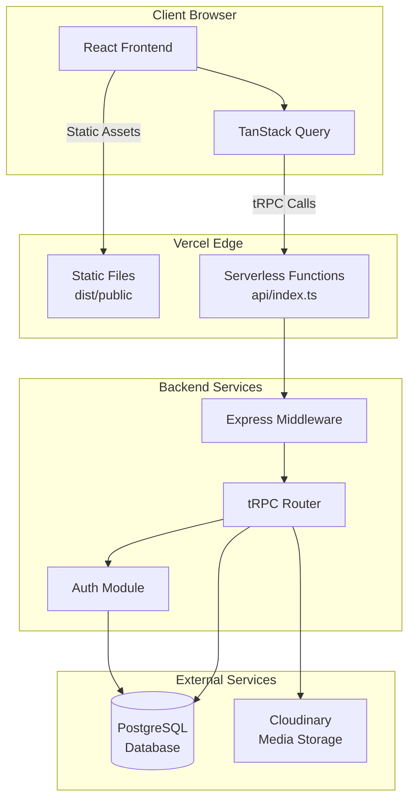
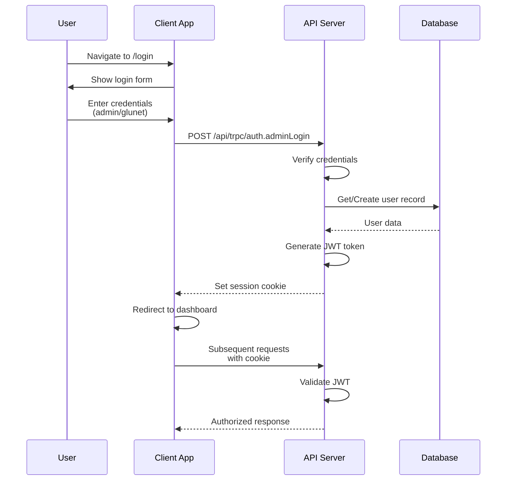
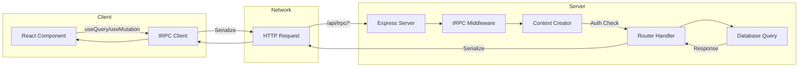
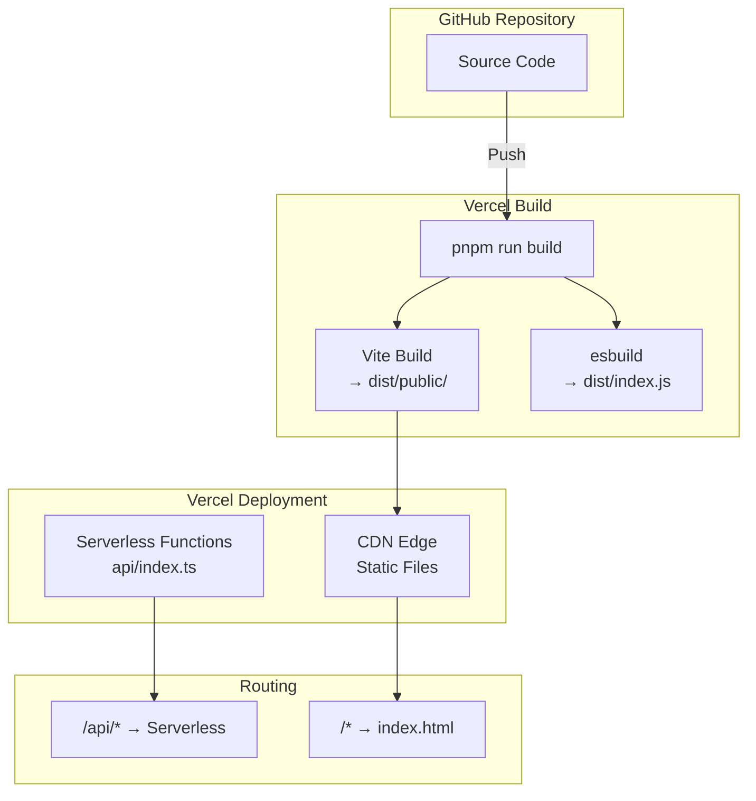
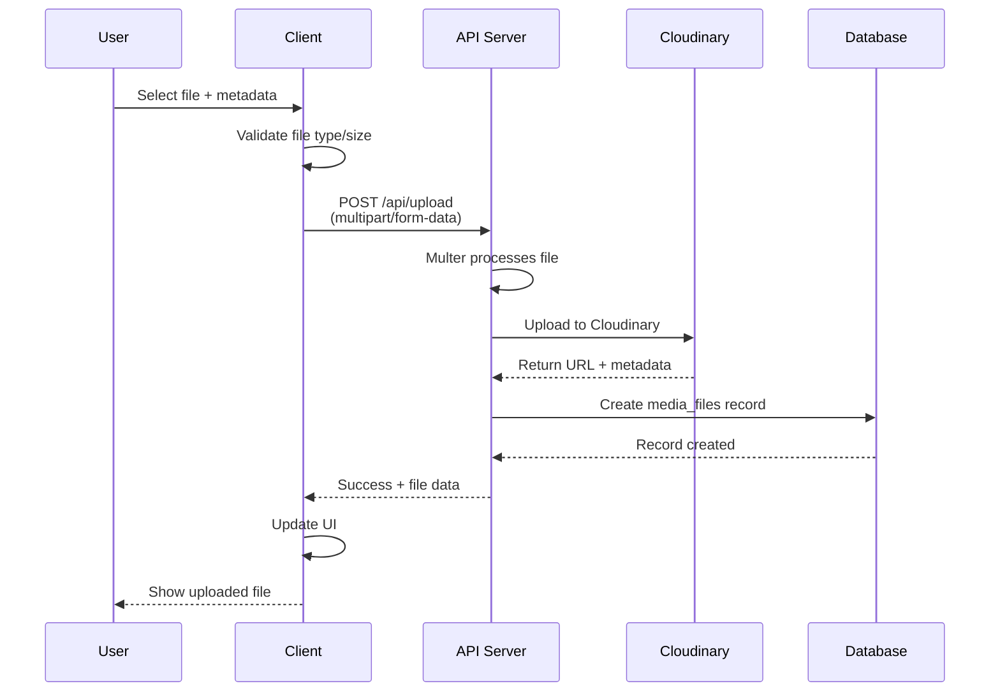

# Architecture Diagrams (Mermaid Source)

This file contains the editable Mermaid diagram source code for the Music Hosting Platform architecture.
These diagrams can be edited and rendered using any Mermaid-compatible viewer or the [Mermaid Live Editor](https://mermaid.live/).

---

## 1. System Overview

Shows the high-level architecture of the application including React frontend, Vercel deployment, tRPC backend, and external services.



---

## 2. Authentication Flow

Sequence diagram showing the complete login flow from user interaction to JWT token generation.



---

## 3. API Request Flow

Flowchart showing how tRPC requests travel from React components through the network to the server and back.



---

## 4. Vercel Deployment Architecture

Shows the build and deployment process on Vercel, including how routes are handled.



---

## 5. File Upload Flow

Sequence diagram showing the complete file upload process from user selection to database storage.



---

## Generating Images

To generate PNG images from these diagrams, you can use the Mermaid CLI:

```bash
# Install Mermaid CLI
npm install -g @mermaid-js/mermaid-cli

# Generate PNG from a .mmd file
mmdc -i diagram.mmd -o diagram.png -b transparent
```

Or use the [Mermaid Live Editor](https://mermaid.live/) to export diagrams manually.

